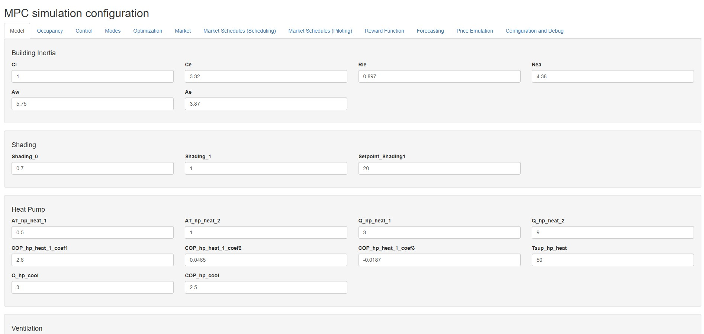

# Model Parametrization

## Introduction

This computational code has many parameters that can be modified to adapt the model to different buildings, contexts, and simulation settings. This section describes the main parameters of the model and how they can be modified.

All these parameters can be updated through a graphic user interfade. See "Graphic User Interface (GUI)" below.

## Parameter Files

All configuration parameters are stored as CSV files in `01_Simulation/02_Config/`. Each file follows a `Parameter,Value` format and controls a specific aspect of the simulation. The parameter files are presented in subsections below.

Please be aware that this file reports on the parameter files. For a detailed definition of models to be parametrized, please refer to [Model.md](Model.md).

### 04_use_patterns.csv ("Occupancy in GUI)

Defines the use patterns, as follows:

A set of day types are defined (i.e. TYPE001), as an array of 24 values, each of them being either 1 or 0. See example below:

TYPE001,0,0,0,0,0,0,1,1,1,1,1,1,1,1,1,1,1,1,1,0,0,0,0,0


Then, these types are assigned per day of the week on a monthly basis. see the example below:

MONTH01,TYPE001,TYPE002,TYPE001,TYPE001,TYPE003,TYPE003,TYPE003


The minimum file should contain:

1 TYPE table, with at least one row.

1 MONTH table, with one row per month.


All types assigned in the month table should be present in the type table.


### 11_model_parameters.csv — Building Physics & HVAC ("Model" in GUI)

Contains the physical and thermal parameters of the building and HVAC system, including:

- **Building thermal properties**: Internal thermal mass (`Ci`), external thermal mass (`Ce`), internal-external thermal resistance (`Rie`), external-ambient resistance (`Rea`), window area (`Aw`), envelope area (`Ae`), and thermal inertia distribution factor (`inertial_fact`).
- **Solar control**: Shading factors (`Shading_0`, `Shading_1`) and the temperature trigger for shading activation (`Setpoint_Shading1`).
- **Heat pump — Heating**
  - Temperature difference thresholds (`AT_hp_heat_1`, `AT_hp_heat_2`)
  - Heating power at each stage (`Q_hp_heat_1`, `Q_hp_heat_2`)
  - COP coefficients (`COP_hp_heat_1_coef1`, `COP_hp_heat_1_coef2`, `COP_hp_heat_1_coef3`, `COP_hp_heat_2`)
  - and supply temperature (`Tsup_hp_heat`).
- **Heat pump — Cooling**: Cooling parameters (`AT_hp_cool`, `Q_hp_cool`, `COP_hp_cool`).
- **Ventilation**: Ventilation resistance parameters (`Rvent01`, `Rvent1`, `Rvent2`) and ventilation temperature setpoint (`Setpoint_Rvent1`).
- **State initialization**: Initial indoor temperature (`Ti_0`), envelope temperature (`Te_0`), heating power (`Qh_0`), and cooling power (`Qc_0`).
  
  

### 12_Control_parameters.csv — Control Parameters ("Control" in GUI)

Contains HVAC control settings:

- **Setpoint ranges**: Minimum and maximum heating and cooling setpoints (`set_point_range_heating_low`, `set_point_range_heating_high`, `set_point_range_cooling_low`, `set_point_range_cooling_high`).
- **Hysteresis & defaults**: Temperature deadband (`Deadband`) and default heating and cooling setpoints.
- **Control type**: `control_type` — "modes" for mode-based optimization, "setpoints" for setpoint-based optimization.
- **Flexibility parameters**:
- - Maximum event length (`flexibility_event_length_max`)
  - Number of flexibility splits (`flexibility_splits`)
  - Recovery timespan (`flexibility_recover_timespan`)
  - Thermal stabilization time (`thermal_stabilization_timespan`)
  - Flexibility commitment level (`flexibility_commitment`)
  - Minimum flexibility (`minimum_flexibility`)

### 13_Modes_setpoints.csv ("Modes" in GUI)

Defines the operational modes (for use when control_type is set to "modes" in 12_Control_parameters.csv).

The following table is expected, with at least one row (actually all the MPC issue doesn´t make sense at all with only one row):

`mode,heating,cooling
1,5,45
2,21,25
3,22,25`

... 

### 14_Optimization_parameters.csv — Genetic Algorithm ("Optimization" in GUI)

Contains parameters for the genetic algorithm:

- Population size (`population_size`)
- Number of iterations/generations (`iteration_number`)
- Number of runs (`run_number`)
- Crossover probability (`pcrossover`)
- Mutation probability (`pmutation`)

### 15_Market_config.csv— Definition of market structure ("Market" in GUI)

Defines the market structures. THe market structure can be quite basic (defined in this same file) or more advanced (defined in 16_... and 17_....csv files, see below).

The file contains the following structure:

Market definition:

* Maket resolution (in minutes)

* Complex market configuration (yes/no)

Scheduling and Piloting Markets (2 equal, but separate blocks, only used if Complex_Market_Config=No):

- Optimization horizon, in hours

- Implementation horizon in hours

- Anticipation in hours

- Optimization aim. with the following options: Energy (`E`), Energy + Flexibility (`E+F`), Operation (`O`) and Operation+Flexibility (`O+F`)

### 16_Market_config_scheduling.csv ("Market Schedules (Scheduling)" in GUI)

This file defines a set of scheduling markets, to be replicated every day. a table with the following columns:

- Market: Name of the market, for reference only

- closure: Equivalent to "Anticipation" in 15_Market_config.csv

- begin: hour of the day when the market period begins

- end: Equivalent to "Implementation" in 15_Market_config.csv

- end_optimization: number of hours after the end of implementation to be included in the optimization horizon

- aim: Equivalent to "Optimization aim" in 15_Market_config.csv

Example:

`Market,closure,begin,end,end_optimization,aim
DA,12,0,24,6,E
ID1,6,0,24,6,E
ID2,3,0,24,6,E`


Considering the definition of optimization aims, the reasonable aims for scheduling are E or E+F.

### 17_Market_config_piloting.csv ("Market Schedules (Piloting)" in GUI)

This file defines a set of piloting markets, to be replicated every day. a table with the same configuration as in 16_...csv.

Example:

`Market,closure,begin,end,end_optimization,aim
cID1,1,0,24,6,O
cID2,1,1,23,6,O+F
cID3,1,2,22,6,O
cID4,1,3,21,6,O+F
cID5,1,4,20,6,O
cID6,1,5,19,6,O+F`

...

Considering the definition of optimization aims, the reasonable aims for scheduling are O or O+F. E or E+F are also possible.

### 18_Reward_parameters.csv— Reward Function Parameters

This file file fefines the reward/penalty function used to evaluate optimization solutions. To do this, the weighting factor for confort penalty (`Alpha_Service_Min`) and the confort bounds are defined.

Confort bounds/Service levels are defined as follows:

- Profiles are defined with temperature setpoints (to be used when Occupancy=1) and setbacks (to be used when Occupancy=0), these profiles are used for PILOTING: `Service_T_Low, Service_T_High, Setback_T_Low, Setback_T_High`

- For SCHEDULING, a modified profile is used. If properly parametrized, this would allow to create some inertia for its latter use as flexibility. Here, the setpoint profile is anticipated with regards to the Occupancy profile. This occurs both when occupancy is initiated (`Service_Anticipation_Begin` , in hours) and when it is finalized  (`Service_Anticipation_End`, also in hours). Additionally, temperature boundaries can be made more strict during clearly heating- and cooling-oriented periods. During Heating-oriented periods, the lower service temperature is rised by `Service_AT_Low_Sched_HDD` (in ºC). And during Cooling-oriented periods ,  the upper service temperature is lowered by `Service_AT_High_Sched_CDD` (in ºC). THese periods are established with a Degree-Day methodology (with reference `HDD_base` and `CDD_base`temperature values), calculated over a few days before and after each day (`HDD_period` and `CDD_period`).

Additionally, there is a provision (not yet implemented) to make a weighted cost/revenue calculation, allowing to focus in shorter-term performance. This is cosnidered with `Revenue_discount_per_hour`.

### 19_Forecast_parameters.csv — Weather Forecast Parameters

Controls how weather forecasts are used in the simulation:

- **Forecast type**: `forecast_type` — inaccurate (biased on purpose)  or accurate (just using the weather time series) forecast.
- **Inaccurate model settings**: Number of days of historical data used (`forecast_n_days_back`), weight assigned to history (`forecast_weight_history`), and default external temperature when no previous data is available (`t_ext_24h_default`).

### 20_Flex_price_simulation.csv — Flexibility Price Simulation

Parameters for generating simulated flexibility price signals:

* `Max_flex_periods_day`: Maximum number of flexibility periods per day.
* `Max_flex_com_price`: Maximum commitment price (€/kWh).
* `Max_flex_exec_price`: Maximum execution price (€/kWh).
* `Max_flex_period_duration`: Maximum period duration (hours).
* `Max_flex_probability`: Maximum flexibility activation probability.

### 30_Debug_and_config.csv — Debug & Configuration Flags

Controls the simulation scope and execution behavior:

- `month_subset`: 0 for a full year simulation, 1–12 for a specific month.
- `period_subset`: Subset of timesteps to simulate (0 for all).
- `verbose`: 1 to enable verbose output, 0 to disable.
- `parallel`: 1 to enable parallel execution, 0 to disable.
- `Price_emulation`: 1 to enable price emulation for flexibility, 0 to disable.

## Graphic User Interface (GUI)

A Shiny-based Graphic User Interface is provided in `40_GUI/01_Configure_Simulation/GUI_config.R` to modify all the parameters described above without manually editing CSV files. This GUI is particularly useful for users who are not familiar with coding, as it provides an intuitive and user-friendly way to modify the parameters of the model and generate the necessary configuration files for the simulations.

### How to launch the GUI

From the repository root directory, run the following command in R:

```r
shiny::runApp("40_GUI/01_Configure_Simulation")
```

Alternatively, open `40_GUI/01_Configure_Simulation/GUI_config.R` in RStudio and click the "Run App" button.

### GUI Structure

The GUI is organized into 8 tabs, one for each configuration file:

1. **Model Parameters** — Building physics, solar control, heat pump (heating/cooling), ventilation, and state initialization.
2. **Control Parameters** — Setpoint ranges, hysteresis, control type, optimization aim, and flexibility parameters.
3. **Optimization Parameters** — Genetic algorithm settings and MPC horizon parameters.
4. **Forecast Parameters** — Forecast type selection and inaccurate model parameters.
5. **Reward Parameters** — Comfort penalty weights and bounds.
6. **Setpoint Modes** — Editable table for defining operating modes (add/remove rows).
7. **Debug & Config** — Simulation scope, execution flags, and price emulation toggle.
8. **Flex Price Simulation** — Flexibility price generation parameters.

Each tab displays the current values from the corresponding CSV file. The user can edit the values and click the "Save" button to write the changes back to the CSV file.

A screenshot of the GUI can be found below (may change with versions as it is commonly re-build with model re-parametrization).
{width="600"}

------------------------------------------------------------------------

[Back to README](../README.md)
