# Full Relations Map

Complete interaction map between **all** scripts and functions in the repository. Covers Main.R, Main_SCC.R, all 01_Simulation scripts and functions, the GUI scripts, PostProcess scripts, and utility scripts.

## Relation Map (Mermaid Diagram)

```mermaid
graph TD
    Main_R["Main.R"] --"sources"--> Script__initialization_R["Script: initialization.R"]
    Main_R["Main.R"] --"sources"--> Script__data_model_parameters_R["Script: data_model_parameters.R"]
    Main_R["Main.R"] --"sources"--> Script__control_optimization_parameters_R["Script: control_optimization_parameters.R"]
    Main_R["Main.R"] --"sources"--> Script__price_emulation_R["Script: price_emulation.R"]
    Main_R["Main.R"] --"sources"--> Script__simulation_R["Script: simulation.R"]
    Main_R["Main.R"] --"sources"--> Script__data_outputs_R["Script: data_outputs.R"]
    Script__initialization_R["Script: initialization.R"] --"calls"--> Func__initialization__["Func: initialization()"]
    Func__initialization__["Func: initialization()"] --"sources"--> Func__validate_Main_df__["Func: validate_Main_df()"]
    Func__initialization__["Func: initialization()"] --"sources"--> Func__load_parameters__["Func: load_parameters()"]
    Func__initialization__["Func: initialization()"] --"sources"--> Func__load_control_parameters__["Func: load_control_parameters()"]
    Func__initialization__["Func: initialization()"] --"sources"--> Func__load_optimization_parameters__["Func: load_optimization_parameters()"]
    Func__initialization__["Func: initialization()"] --"sources"--> Func__load_debug_and_config_parameters__["Func: load_debug_and_config_parameters()"]
    Func__initialization__["Func: initialization()"] --"sources"--> Func__context_forecast_step__["Func: context_forecast_step()"]
    Func__initialization__["Func: initialization()"] --"sources"--> Func__imperfect_forecast__["Func: imperfect_forecast()"]
    Func__initialization__["Func: initialization()"] --"sources"--> Func__optimize_control_step__["Func: optimize_control_step()"]
    Func__initialization__["Func: initialization()"] --"sources"--> Func__optimize_setpoints__["Func: optimize_setpoints()"]
    Func__initialization__["Func: initialization()"] --"sources"--> Func__optimize_modes__["Func: optimize_modes()"]
    Func__initialization__["Func: initialization()"] --"sources"--> Func__fitness_funct_optimize_setpoint__["Func: fitness_funct_optimize_setpoint()"]
    Func__initialization__["Func: initialization()"] --"sources"--> Func__fitness_funct_optimize_mode__["Func: fitness_funct_optimize_mode()"]
    Func__initialization__["Func: initialization()"] --"sources"--> Func__evaluate_control__["Func: evaluate_control()"]
    Func__initialization__["Func: initialization()"] --"sources"--> Func__period_calculation__["Func: period_calculation()"]
    Func__initialization__["Func: initialization()"] --"sources"--> Func__reward_function__["Func: reward_function()"]
    Func__initialization__["Func: initialization()"] --"sources"--> Func__flex_evaluation__["Func: flex_evaluation()"]
    Func__initialization__["Func: initialization()"] --"sources"--> Func__implement_control_step__["Func: implement_control_step()"]
    Func__initialization__["Func: initialization()"] --"sources"--> Func__convert_setpoints__["Func: convert_setpoints()"]
    Func__initialization__["Func: initialization()"] --"sources"--> Func__convert_modes_to_setpoints__["Func: convert_modes_to_setpoints()"]
    Func__initialization__["Func: initialization()"] --"sources"--> Func__maxmode__["Func: maxmode()"]
    Script__data_model_parameters_R["Script: data_model_parameters.R"] --"calls"--> Func__validate_Main_df__["Func: validate_Main_df()"]
    Script__data_model_parameters_R["Script: data_model_parameters.R"] --"calls"--> Func__load_parameters__["Func: load_parameters()"]
    Script__control_optimization_parameters_R["Script: control_optimization_parameters.R"] --"calls"--> Func__load_control_parameters__["Func: load_control_parameters()"]
    Script__control_optimization_parameters_R["Script: control_optimization_parameters.R"] --"calls"--> Func__load_optimization_parameters__["Func: load_optimization_parameters()"]
    Script__control_optimization_parameters_R["Script: control_optimization_parameters.R"] --"calls"--> Func__load_debug_and_config_parameters__["Func: load_debug_and_config_parameters()"]
    Script__simulation_R["Script: simulation.R"] --"calls"--> Func__context_forecast_step__["Func: context_forecast_step()"]
    Script__simulation_R["Script: simulation.R"] --"calls"--> Func__implement_control_step__["Func: implement_control_step()"]
    Script__simulation_R["Script: simulation.R"] --"calls"--> Func__optimize_control_step__["Func: optimize_control_step()"]
    Func__context_forecast_step__["Func: context_forecast_step()"] --"calls"--> Func__imperfect_forecast__["Func: imperfect_forecast()"]
    Func__optimize_control_step__["Func: optimize_control_step()"] --"calls"--> Func__optimize_setpoints__["Func: optimize_setpoints()"]
    Func__optimize_control_step__["Func: optimize_control_step()"] --"calls"--> Func__optimize_modes__["Func: optimize_modes()"]
    Func__optimize_control_step__["Func: optimize_control_step()"] --"calls"--> Func__evaluate_control__["Func: evaluate_control()"]
    Func__optimize_control_step__["Func: optimize_control_step()"] --"calls"--> Func__convert_setpoints__["Func: convert_setpoints()"]
    Func__optimize_control_step__["Func: optimize_control_step()"] --"calls"--> Func__convert_modes_to_setpoints__["Func: convert_modes_to_setpoints()"]
    Func__optimize_control_step__["Func: optimize_control_step()"] --"calls"--> Func__period_calculation__["Func: period_calculation()"]
    Func__optimize_setpoints__["Func: optimize_setpoints()"] --"calls"--> Func__fitness_funct_optimize_setpoint__["Func: fitness_funct_optimize_setpoint()"]
    Func__fitness_funct_optimize_setpoint__["Func: fitness_funct_optimize_setpoint()"] --"calls"--> Func__convert_setpoints__["Func: convert_setpoints()"]
    Func__fitness_funct_optimize_setpoint__["Func: fitness_funct_optimize_setpoint()"] --"calls"--> Func__evaluate_control__["Func: evaluate_control()"]
    Func__optimize_modes__["Func: optimize_modes()"] --"calls"--> Func__fitness_funct_optimize_mode__["Func: fitness_funct_optimize_mode()"]
    Func__optimize_modes__["Func: optimize_modes()"] --"calls"--> Func__maxmode__["Func: maxmode()"]
    Func__fitness_funct_optimize_mode__["Func: fitness_funct_optimize_mode()"] --"calls"--> Func__convert_modes_to_setpoints__["Func: convert_modes_to_setpoints()"]
    Func__fitness_funct_optimize_mode__["Func: fitness_funct_optimize_mode()"] --"calls"--> Func__evaluate_control__["Func: evaluate_control()"]
    Func__fitness_funct_optimize_mode__["Func: fitness_funct_optimize_mode()"] --"calls"--> Func__maxmode__["Func: maxmode()"]
    Func__evaluate_control__["Func: evaluate_control()"] --"calls"--> Func__period_calculation__["Func: period_calculation()"]
    Func__evaluate_control__["Func: evaluate_control()"] --"calls"--> Func__reward_function__["Func: reward_function()"]
    Func__evaluate_control__["Func: evaluate_control()"] --"calls"--> Func__flex_evaluation__["Func: flex_evaluation()"]
    Func__flex_evaluation__["Func: flex_evaluation()"] --"calls"--> Func__period_calculation__["Func: period_calculation()"]
    Func__implement_control_step__["Func: implement_control_step()"] --"calls"--> Func__period_calculation__["Func: period_calculation()"]
    Main_SCC_R["Main_SCC.R"] --"sources"--> Script__initialization_SCC_R["Script: initialization_SCC.R"]
    Main_SCC_R["Main_SCC.R"] --"sources"--> Script__data_model_parameters_R["Script: data_model_parameters.R"]
    Main_SCC_R["Main_SCC.R"] --"sources"--> Script__control_optimization_parameters_SCC_R["Script: control_optimization_parameters_SCC.R"]
    Main_SCC_R["Main_SCC.R"] --"sources"--> Script__price_emulation_R["Script: price_emulation.R"]
    Main_SCC_R["Main_SCC.R"] --"sources"--> Script__simulation_R["Script: simulation.R"]
    Main_SCC_R["Main_SCC.R"] --"sources"--> Script__data_outputs_SCC_R["Script: data_outputs_SCC.R"]
    PostProcess__PostProcess_hyperparameter_analysis_R["PostProcess: PostProcess_hyperparameter_analysis.R"] --"calls"--> Func__plot_and_save____HP_["Func: plot_and_save() [HP]"]
    PostProcess__PostProcess_flexibility_analysis_R["PostProcess: PostProcess_flexibility_analysis.R"] --"calls"--> Func__plot_and_save____Flex_["Func: plot_and_save() [Flex]"]
    PostProcess__PostProcess_flexibility_analysis_R["PostProcess: PostProcess_flexibility_analysis.R"] --"calls"--> Func__safe_ylim__["Func: safe_ylim()"]
    PostProcess__PostProcess_flexibility_analysis_R["PostProcess: PostProcess_flexibility_analysis.R"] --"calls"--> Func__safe_ylim_global__["Func: safe_ylim_global()"]
    Utils__download_data_R["Utils: download_data.R"] --"calls"--> Func__download_esios_prices__["Func: download_esios_prices()"]
    Utils__download_data_R["Utils: download_data.R"] --"calls"--> Func__download_open_meteo__["Func: download_open_meteo()"]
    Func__download_esios_prices__["Func: download_esios_prices()"] --"calls"--> Func__download_single_indicator__["Func: download_single_indicator()"]
    Func__download_open_meteo__["Func: download_open_meteo()"] --"calls"--> Func__expand_to_15min__["Func: expand_to_15min()"]
    Utils__get_esios_ids_R["Utils: get_esios_ids.R"] --"calls"--> Func__download_single_indicator__["Func: download_single_indicator()"]
    Utils__csv_to_rds_R["Utils: csv_to_rds.R"] --"sources"--> Script___standalone_conversion_["Script: (standalone conversion)"]
    GUI__GUI_config_R["GUI: GUI_config.R"] --"calls"--> Func__read_param_csv__["Func: read_param_csv()"]
    GUI__GUI_config_R["GUI: GUI_config.R"] --"calls"--> Func__write_param_csv__["Func: write_param_csv()"]
    GUI__GUI_config_R["GUI: GUI_config.R"] --"calls"--> Func__get_val__["Func: get_val()"]
    GUI__GUI_parametric_R["GUI: GUI_parametric.R"] --"calls"--> Func__build_param_range__["Func: build_param_range()"]
    GUI__GUI_parametric_R["GUI: GUI_parametric.R"] --"calls"--> Func__generate_full_factorial__["Func: generate_full_factorial()"]
    GUI__GUI_parametric_R["GUI: GUI_parametric.R"] --"calls"--> Func__save_optim_params__["Func: save_optim_params()"]
```

## Detailed Relation Table

| From | To | Type | Variables / Data Passed |
|------|----|------|------------------------|
| Main.R | Script: initialization.R | sources |  |
| Main.R | Script: data_model_parameters.R | sources |  |
| Main.R | Script: control_optimization_parameters.R | sources |  |
| Main.R | Script: price_emulation.R | sources | Price_emulation==1 (conditional) |
| Main.R | Script: simulation.R | sources | simulation_script (path variable) |
| Main.R | Script: data_outputs.R | sources |  |
| Script: initialization.R | Func: initialization() | calls | library_file, functions_path |
| Func: initialization() | Func: validate_Main_df() | sources | functions_path |
| Func: initialization() | Func: load_parameters() | sources | functions_path |
| Func: initialization() | Func: load_control_parameters() | sources | functions_path |
| Func: initialization() | Func: load_optimization_parameters() | sources | functions_path |
| Func: initialization() | Func: load_debug_and_config_parameters() | sources | functions_path |
| Func: initialization() | Func: context_forecast_step() | sources | functions_path |
| Func: initialization() | Func: imperfect_forecast() | sources | functions_path |
| Func: initialization() | Func: optimize_control_step() | sources | functions_path |
| Func: initialization() | Func: optimize_setpoints() | sources | functions_path |
| Func: initialization() | Func: optimize_modes() | sources | functions_path |
| Func: initialization() | Func: fitness_funct_optimize_setpoint() | sources | functions_path |
| Func: initialization() | Func: fitness_funct_optimize_mode() | sources | functions_path |
| Func: initialization() | Func: evaluate_control() | sources | functions_path |
| Func: initialization() | Func: period_calculation() | sources | functions_path |
| Func: initialization() | Func: reward_function() | sources | functions_path |
| Func: initialization() | Func: flex_evaluation() | sources | functions_path |
| Func: initialization() | Func: implement_control_step() | sources | functions_path |
| Func: initialization() | Func: convert_setpoints() | sources | functions_path |
| Func: initialization() | Func: convert_modes_to_setpoints() | sources | functions_path |
| Func: initialization() | Func: maxmode() | sources | functions_path |
| Script: data_model_parameters.R | Func: validate_Main_df() | calls | Main_df |
| Script: data_model_parameters.R | Func: load_parameters() | calls | model_file → model_parameters |
| Script: data_model_parameters.R | Func: load_parameters() | calls | reward_file → reward_parameters |
| Script: data_model_parameters.R | Func: load_parameters() | calls | forecast_file → forecast_parameters |
| Script: control_optimization_parameters.R | Func: load_control_parameters() | calls | control_file → parameters$control_parameters |
| Script: control_optimization_parameters.R | Func: load_optimization_parameters() | calls | optimization_file → parameters$optimization_parameters |
| Script: control_optimization_parameters.R | Func: load_debug_and_config_parameters() | calls | debug_and_config_file → parameters$debug_and_config_parameters |
| Script: simulation.R | Func: context_forecast_step() | calls | i0, time_sec, Main_df, parameters, i_end_horizon → ctx (forecast_df) |
| Script: simulation.R | Func: implement_control_step() | calls | period_chunk, indexes, timestamps, parameters, calculation_mode=1, calculation_context='plan' → period_chunk |
| Script: simulation.R | Func: optimize_control_step() | calls | period_chunk, timestamps, parameters, indexes → list(period_chunk) |
| Script: simulation.R | Func: implement_control_step() | calls | period_chunk, indexes, timestamps, parameters, calculation_mode=1, calculation_context='execution' → period_chunk |
| Func: context_forecast_step() | Func: imperfect_forecast() | calls | Main_df, target_col, i0, n_days_back, weight_history → predicted values (conditional: forecast_type=='inaccurate') |
| Func: optimize_control_step() | Func: optimize_setpoints() | calls | period_chunk, timestamps, parameters → set_point_optimized (conditional: control_type=='setpoint') |
| Func: optimize_control_step() | Func: optimize_modes() | calls | period_chunk, timestamps, parameters → setpoint_modes_df_optimized (conditional: control_type=='modes') |
| Func: optimize_control_step() | Func: evaluate_control() | calls | period_chunk, set_point_df, parameters → list(period_chunk, reward) |
| Func: optimize_control_step() | Func: convert_setpoints() | calls | setpoints_heating, setpoints_cooling, parameters, timestamps → set_point_df |
| Func: optimize_control_step() | Func: convert_modes_to_setpoints() | calls | setpoint_modes_df, parameters, timestamps → set_point_df |
| Func: optimize_control_step() | Func: period_calculation() | calls | period_chunk, parameters, set_point_df → period_chunk (forecasted states) |
| Func: optimize_setpoints() | Func: fitness_funct_optimize_setpoint() | calls | setpoint_array, period_chunk, parameters, timestamps → reward scalar (via GA) |
| Func: fitness_funct_optimize_setpoint() | Func: convert_setpoints() | calls | setpoints_heating, setpoints_cooling, parameters, timestamps → set_point_df |
| Func: fitness_funct_optimize_setpoint() | Func: evaluate_control() | calls | period_chunk, set_point_df, parameters → list(period_chunk, reward) |
| Func: optimize_modes() | Func: fitness_funct_optimize_mode() | calls | x_bin, period_chunk, parameters, timestamps, n_modes, n_periods, target_periods → reward scalar (via GA) |
| Func: optimize_modes() | Func: maxmode() | calls | x_bin, n_modes, n_periods, target_periods → decoded mode vector |
| Func: fitness_funct_optimize_mode() | Func: convert_modes_to_setpoints() | calls | setpoint_modes_df, parameters, timestamps → set_point_df |
| Func: fitness_funct_optimize_mode() | Func: evaluate_control() | calls | period_chunk, set_point_df, parameters → list(period_chunk, reward) |
| Func: fitness_funct_optimize_mode() | Func: maxmode() | calls | x_bin, n_modes, n_periods, target_periods → decoded mode vector |
| Func: evaluate_control() | Func: period_calculation() | calls | period_chunk, parameters, set_point_df → period_chunk (building states + _plan cols) |
| Func: evaluate_control() | Func: reward_function() | calls | period_chunk, parameters, timestamps → period_chunk$Reward |
| Func: evaluate_control() | Func: flex_evaluation() | calls | period_chunk, parameters, i_flex, flexibility_event_length, flexibility → period_chunk (_plan_flex cols) |
| Func: flex_evaluation() | Func: period_calculation() | calls | period_chunk, parameters, set_point_df, calculation_context='plan_flex' → period_chunk (flex states) |
| Func: implement_control_step() | Func: period_calculation() | calls | period_chunk, parameters, set_point_df, calculation_context='execution'/'plan' → period_chunk (actual states) |
| Main_SCC.R | Script: initialization_SCC.R | sources |  |
| Main_SCC.R | Script: data_model_parameters.R | sources |  |
| Main_SCC.R | Script: control_optimization_parameters_SCC.R | sources |  |
| Main_SCC.R | Script: price_emulation.R | sources | Price_emulation==1 (conditional) |
| Main_SCC.R | Script: simulation.R | sources | simulation_script (path variable) |
| Main_SCC.R | Script: data_outputs_SCC.R | sources |  |
| PostProcess: PostProcess_hyperparameter_analysis.R | Func: plot_and_save() [HP] | calls | plot object, file path |
| PostProcess: PostProcess_flexibility_analysis.R | Func: plot_and_save() [Flex] | calls | plot object, file path |
| PostProcess: PostProcess_flexibility_analysis.R | Func: safe_ylim() | calls | values vector → ylim |
| PostProcess: PostProcess_flexibility_analysis.R | Func: safe_ylim_global() | calls | values list → global ylim |
| Utils: download_data.R | Func: download_esios_prices() | calls | token, indicators, date_range → prices data frame |
| Utils: download_data.R | Func: download_open_meteo() | calls | lat, lon, date_range → weather data frame |
| Func: download_esios_prices() | Func: download_single_indicator() | calls | indicator_id, token, date → indicator data frame |
| Func: download_open_meteo() | Func: expand_to_15min() | calls | hourly data frame → 15-min data frame |
| Utils: get_esios_ids.R | Func: download_single_indicator() | calls | indicator_id, token → indicator info |
| Utils: csv_to_rds.R | Script: (standalone conversion) | sources | CSV path → RDS file |
| GUI: GUI_config.R | Func: read_param_csv() | calls | filename → data frame |
| GUI: GUI_config.R | Func: write_param_csv() | calls | filename, df, header_comment → CSV file |
| GUI: GUI_config.R | Func: get_val() | calls | df, param → numeric value |
| GUI: GUI_parametric.R | Func: build_param_range() | calls | val_min, val_max, val_step → numeric vector |
| GUI: GUI_parametric.R | Func: generate_full_factorial() | calls | params_list → data frame of combinations |
| GUI: GUI_parametric.R | Func: save_optim_params() | calls | df, scc_path, max_array_size → Optim_parameters.csv + scc_settings.sh |

## Node Descriptions

### `Func: build_param_range()`
Builds a numeric sequence from min, max, step inputs.

### `Func: context_forecast_step()`
Extracts or generates weather forecast (Text_forec, SolarR_forec) for the optimization horizon.

### `Func: convert_modes_to_setpoints()`
Converts mode codes to a set_point_df with deadbands from setpoint_modes table.

### `Func: convert_setpoints()`
Converts raw setpoint vectors to a set_point_df with hysteresis deadbands.

### `Func: download_esios_prices()`
Downloads electricity price indicators from the ESIOS API for a given date range and returns a combined data frame.

### `Func: download_open_meteo()`
Downloads hourly weather data (temperature, solar radiation) from the Open-Meteo API for a given location and date range.

### `Func: download_single_indicator()`
Downloads a single ESIOS indicator time series for a given date range.

### `Func: evaluate_control()`
Simulates building over plan period; optionally evaluates flexibility scenarios; returns best reward.

### `Func: expand_to_15min()`
Expands hourly weather data to 15-minute resolution by forward-filling or interpolation.

### `Func: fitness_funct_optimize_mode()`
Fitness function for modes GA: decodes binary → converts to setpoints → evaluates → returns reward.

### `Func: fitness_funct_optimize_setpoint()`
Fitness function for setpoint GA: converts setpoints → evaluates building → returns reward.

### `Func: flex_evaluation()`
Simulates a flexibility event (reduced HVAC) and recovery; updates _plan_flex columns.

### `Func: generate_full_factorial()`
Generates all combinations (full factorial) of parametric configurations.

### `Func: get_val()`
Retrieves a numeric value from a parameter data frame by parameter name.

### `Func: imperfect_forecast()`
Blends historical average with ground-truth to produce realistic forecast errors.

### `Func: implement_control_step()`
Applies optimized setpoints to the actual building model; updates Main_df columns.

### `Func: initialization()`
Sources all .R files in 03_Functions and loads required R libraries.

### `Func: load_control_parameters()`
Loads control_parameters.csv and returns a named list.

### `Func: load_debug_and_config_parameters()`
Loads debug_and_config.csv and returns a named list.

### `Func: load_optimization_parameters()`
Loads optimization_parameters.csv and returns a named list.

### `Func: load_parameters()`
Generic CSV parameter loader; returns a named list.

### `Func: maxmode()`
Decodes a binary chromosome into a mode integer vector.

### `Func: optimize_control_step()`
Runs GA-based optimization (setpoints or modes) over the planning horizon.

### `Func: optimize_modes()`
GA optimization for binary-encoded operation modes.

### `Func: optimize_setpoints()`
GA optimization for real-valued heating/cooling setpoints.

### `Func: period_calculation()`
Core building physics simulation: computes Ti, Te, Q_heat, Q_cool, Elec_*, Comfort for a period.

### `Func: plot_and_save() [Flex]`
Saves a ggplot or base-R plot to a PNG/PDF file in the flexibility analysis output folder.

### `Func: plot_and_save() [HP]`
Saves a ggplot or base-R plot to a PNG/PDF file in the hyperparameter analysis output folder.

### `Func: read_param_csv()`
Reads a parameter CSV (parameter, value) ignoring comment lines.

### `Func: reward_function()`
Calculates per-timestep reward based on energy cost and comfort.

### `Func: safe_ylim()`
Computes y-axis limits from a numeric vector, applying a safety margin to avoid identical min/max.

### `Func: safe_ylim_global()`
Computes global y-axis limits across multiple data series for consistent axis scaling across plots.

### `Func: save_optim_params()`
Saves Optim_parameters.csv and scc_settings.sh with LF line endings.

### `Func: validate_Main_df()`
Validates structure and content of Main_df (columns, types, time order, physical ranges).

### `Func: write_param_csv()`
Writes a parameter CSV preserving header comments.

### `GUI: GUI_config.R`
Shiny app to configure simulation parameters; reads/writes 01_Simulation/02_Config/*.csv files.

### `GUI: GUI_parametric.R`
Shiny app to configure parametric simulations; writes Optim_parameters.csv and scc_settings.sh.

### `Main.R`
Main entry point of the MPC simulation. Sources all sub-scripts in order.

### `Main_SCC.R`
HPC/SCC variant of Main.R. Reads job-specific parameters from Optim_parameters.csv via SLURM_ARRAY_TASK_ID and writes suffixed output files for each parametric run.

### `PostProcess: PostProcess_flexibility_analysis.R`
Post-processes Main_df_computed_*.rds files. Computes E_flex signal and generates per-day temperature/energy plots and summary flexibility charts.

### `PostProcess: PostProcess_hyperparameter_analysis.R`
Post-processes Sinthetized_df_computed_*.rds files from HPC runs. Performs iterative hyperparameter sensitivity analysis and generates scatter and bar charts.

### `Script: (standalone conversion)`

### `Script: control_optimization_parameters.R`
Loads control, optimization and debug parameters; subsets Main_df if needed.

### `Script: control_optimization_parameters_SCC.R`
SCC-specific control/optimization parameter loading. Overrides parameters with values from the current Optim_parameters.csv row.

### `Script: data_model_parameters.R`
Loads Main_df (time-series data) and model/reward/forecast parameters.

### `Script: data_outputs.R`
Exports Main_df and summary Sinthetized_df to CSV and RDS files.

### `Script: data_outputs_SCC.R`
SCC-specific output export: writes Sinthetized_df_computed and Main_df_computed files with parameter-set suffix for each job.

### `Script: initialization.R`
Resets environment, sets paths, validates files, loads libraries and all functions.

### `Script: initialization_SCC.R`
SCC-specific initialization: reads per-job parameter row from Optim_parameters.csv using SLURM_ARRAY_TASK_ID and sets up paths for HPC environment.

### `Script: price_emulation.R`
Overwrites flex price columns in Main_df with randomly generated daily signals.

### `Script: simulation.R`
Main MPC loop: for each timestep performs context forecast, plan initialization, GA optimization, and control implementation.

### `Utils: csv_to_rds.R`
Utility script to convert Main_df.csv to Main_df.rds for faster loading during simulation.

### `Utils: download_data.R`
Utility script to download weather data from Open-Meteo and electricity prices from ESIOS API; writes CSV files to 01_Data.

### `Utils: get_esios_ids.R`
Utility script to query ESIOS API for available indicator IDs and names.
