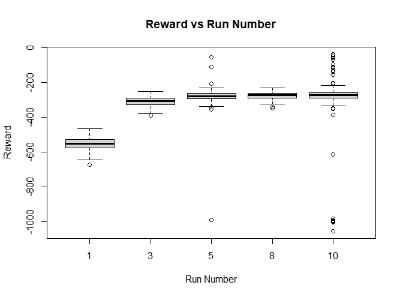
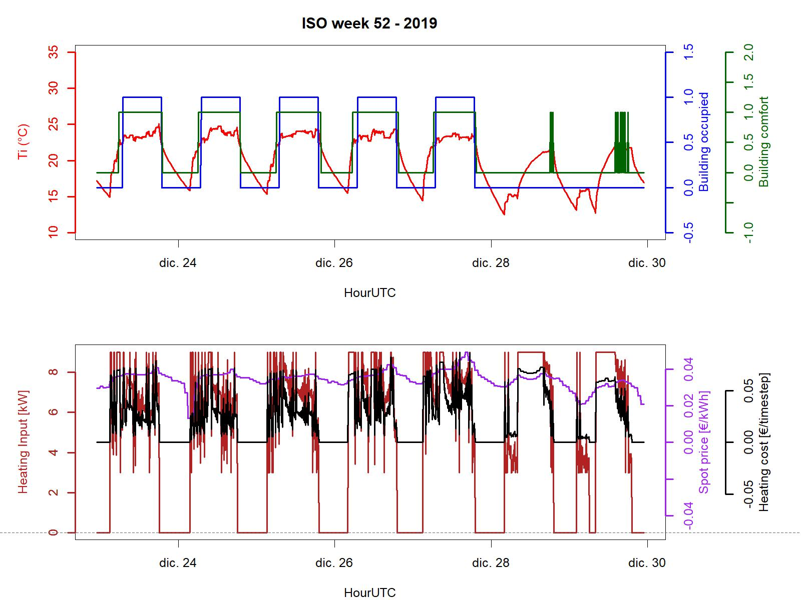
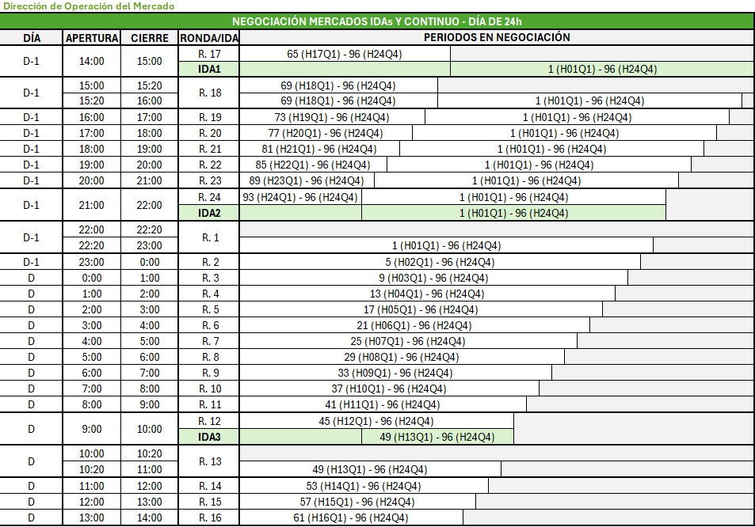
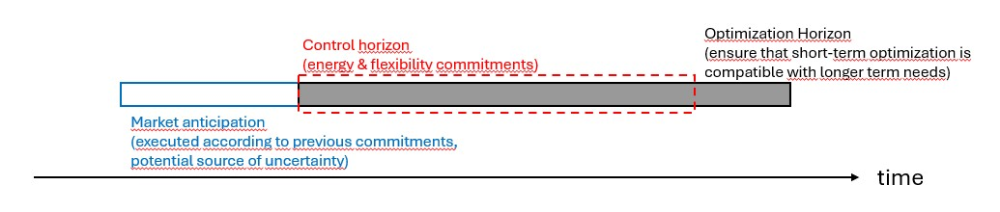

# Model Predictive Control for Buildings

This project is a test environment for Model Predictive Control in Buildings. Much more could be written here, but it is easier to explore each subsection below to understand the project and see if it is useful for a given case.

## Index

1. [Content of this repository](#1-content-of-this-repository)
2. [Context](#2-context)
3. [Components](#3-components)
4. [Model](#4-model)
5. [Control modes & setpoints](#5-control-modes--setpoints)
6. [Policy](#6-policy)
7. [Market Structure](#7-market-structure)
8. [Decision making processes and optimization aims](#8-decision-making-processes-and-optimization-aims)
9. [Marginal cost in the evaluation of solutions](#9-marginal-cost-in-the-evaluation-of-solutions)
10. [Genetic algorithm](#10-genetic-algorithm)
11. [Optimization and control horizons](#11-optimization-and-control-horizons)
12. [Flexibility events](#12-flexibility-events)
13. [Parametrization and Graphic User Interface](#13-parametrization-and-graphic-user-interface)
14. [Input-Output files](#14-input-output-files)
15. [Economic data structures](#15-economic-data-structures)
16. [Notes on code usage](#16-notes-on-code-usage)
17. [Changes and version control](#17-changes-and-version-control)
18. [Known Issues](#18-known-issues)
19. [Discontinued items](#19-discontinued-items)
20. [Authors & contributors](#20-authors--contributors)
21. [Future works](#21-future-works)
22. [Acknowledgements](#22-acknowledgements)

# 1. Content of this repository

In this repository, a model predictive control for building is tested. A full-year simulation is performed and the most optimal action path is decided periodically.

The optimal action path considers the following:

- Ensuring optimal comfort during occupancy periods

- Minimizing the cost of energy

- Committing in the flexibility market (optional)

The specific interest of this repository is that the optimal action is defined in a decision-making process structured and syncronized with day-ahead, intra-day and continuous intra-day markets.

Some output:

It should be noted that figures correspond to an earlier version of the code. Although the code allows for a more complex decision-making process, these figures represent a basic approach where at each midnight, the action path for the following day is decided.

The code is fully parametrized, and tested for parametric simulations in supercomputers. Auxiliary scripts and graphic interfaces are provided. (all this is better explained below)

[back to top](#model-predictive-control-for-buildings)

# 2. Context

Buildings are inertial systems. Conditioning these for human use also implies that a large share of energy is used to heat-up/cool-down building structures. These structures have a relevant inertia, with associated transient processes. There is some time between starting to heat a building and reaching a comfortable status. Equally, if heating is turned off, temperature variations will be slow, allowing to keep comfort for some time.

There is an increasing number of houses heated/cooled with electric systems, commonly heat pumps. These systems present a number of particularities that should be considered for their operation:

- Relatively low installed capacity. Due to large equipment costs, heat pump sizing is quite sharp, and complemented with backup electric resistances.

- Heat pump performance is very dependent on outdoor temperature.

- The cost of heating with heat pumps is linked to the cost of electricity, which is increasingly variable due to increasing shares of renewable energy in the electricity production mix.

These systems would benefit from a predictive control to activate heat pumps during low cost periods while ensuring occupant comfort. Model Predictive Control (MPC) is an increasingly common approach for this.

Additionally, electric networks are increasingly populated with renewable energy sources, and many energy-using systems are switching to electric energy (i.e. Electric Vehicles, or Heat Pumps). This imposes increasing constraints and stress to the electric network. Due to the specificities of the electric system, it must react to any deviation (i.e. failure of one power plant,...) by adapting load profiles and/or replacing the energy generation. Systems that are willing to help the stability of the electric system are rewarded based on their availability, as well as the execution of commitments.

Again, the thermal inertia in buildings seems to be a good source of flexibility. Once heated, the building will remain hot/warm for some time, even if Heat Pumps are stopped/operated at lower load for some time.

[back to top](#model-predictive-control-for-buildings)

# 3. Components

The Model Predictive Control system consists of the following:

- A full year worth of meteorological data and electricity prices `30_Simulation/01_Data/Meteo_df.rds` and `30_Simulation/01_Data/Energy_Prices_df.rds` (or .csv)

- A semi physical (RC) building energy model linked to a heat pump model `30_Simulation/02_Config/11_Model_parameters.csv`

- A genetic algorithm to perform the predictive optimization

- A policy to assess the goodness of a particular solution

- A large set of configuration files allowing for the parametrization of the simulation `30_Simulation/02_Config/`

[back to top](#model-predictive-control-for-buildings)

# 4. Model

The energy model is based on a reduced order (RC) building model with integrated HVAC and heat pump models. The details of the model, including the building physics, thermostat, heating and cooling systems, ventilation, shading, and occupancy are described in [Model](99_Readme/Model.md).

[back to top](#model-predictive-control-for-buildings)

# 5. Control modes & setpoints

2 control modes are foreseen:

- Setpoint based: Here, setpoints for heating and cooling are freely set by the optimized within a pre-defined range, as per the indications above.

- Mode based: Here, the optimizer decide from a pre-defined set of modes in the `setpoint_modes.csv` file. Each mode has pre-set heating and cooling setpoints.

The control mode is flagged through the "control_type" variable in the main.R script.

Even if simulations are performed at a lower resolution, setpoints and modes are defined in agreement with a market resolution (typically 15 minutes or one hour).

Although still in early stages of research, it seems that Mode-based optimization is a faster and better approach.

[back to top](#model-predictive-control-for-buildings)

# 6. Policy

A policy that incorporates heating costs and comfort is used.

- Comfort: System temperature is compared with reference temperatures during the occupancy periods. If the building is outside comfort bounds, a high penalty is given (the negative of the `Alpha_confort` parameter, now set to 50). Reference temperatures are defined separately for Scheduling and Piloting periods.

- Energy (and flexibility): The cost of Energy is aimed to be minimized. Accordingly, the cost of heating is considered as a negative reward.

Then both terms are added.

It should be stated that the cost of energy is typically in the range of 0,0X. That is, 2-3 orders of magnitude below the penalty for being out of comfort. Accordingly, this reward is highly biased towards prioritizing occupant comfort.

For the cases where the optimization aim is flexibility, a more complex reward formula definition is used:

- Comfort is assessed both for the case with baseline operation and for the extreme case where all the flexibility is activated.

- The revenues for flexibility commitments are incorporated. With regards to the activation of flexibility, this is considered, but weighted for the likelihood of activation.

More information on this is available in [Flexibility_Events](99_Readme/Flexibility_Events.md).

[back to top](#model-predictive-control-for-buildings)

# 7. Market Structure

In this work, energy flows are defined in a 3-level market:

1. Scheduling
2. Piloting
3. Execution

Quite in line with how markets operate in Western Europe.

- Scheduling markets correspond with day-ahead and intra-day markets. In these markets the base programme for energy production and use is defined, quite in advance (i.e. day-ahead markets close 12h before the actually-traded day). Given this anticipation, it is common to have poor accuracy in load prediction, particularly for small and non-industrial loads. There is one day-ahead and 3 intra-day markets per day.

- Piloting markets are scheduled every hour and allow to adapt loads starting \~one hour after market closure. This allows to substantially adapt the base energy use programme with better and shorter load forecasts.

- Execution is not a market per se. This is just real-life energy delivery. It is common to have some deviations in this delivery when compared with the energy traded in the previous markets.

The following picture shows the structure of Day Ahead (DA), Intra Day (ID) and Continuous Intra Day (cID) in Spain.

Source: [OMIE, Mercado de Electricidad (2026/06/13)](https://www.omie.es/es/mercado-de-electricidad)

[back to top](#model-predictive-control-for-buildings)

# 8. Decision making processes and optimization aims

Decision-making process occurs in two steps:

- Scheduling. A long-term setpoint/operational mode schedule is defined. This is commonly linked to day-ahead and/or intra-day markets, where schedules up to \~ 36h ahead are defined.

- Piloting. Here, the already-defined overall schedule is "piloted" and potentially adapted for changes in the price of energy or potential short-term flexibility needs

In these cases the following optimization aims are considered:

- Energy: System setpoints/modes are optimized so that the energy cost is minimized (or revenues maximized).

- Energy+Flexibility: System setpoints/modes are optimized, for minimal energy costs/maximal energy revenues, but also leaving some space to commit flexibility services to the market.

- Operation: This mode is only possible when a previous Energy (or Energy+Flexibility) optimization has been executed. It is used in Piloting decision processes, where setpoints are already pre-defined, but the volumes of purchased energy can be modified due to closer forecasting of the behavior of the building.

- Operation+Flexibility: This mode is similar to the previous one, but allows for the commitment in the flexibility market on short notice.

In all cases, the [policy](#6-policy) weights economic costs/revenues and comfort levels.

Considering that scheduling and piloting processes have different aims, heating and cooling thresholds are established separately for each of them. Typicall (but not strictly required), Scheduling constraints are heavier than Piloting. Allowing for greater adaptarion in the short term. These are established in `30_Simulation/02_Config/18_Reward_parameters.csv`

More information on the flexibility market, revenues and how to consider this in the policy is available in [Flexibility_Events](99_Readme/Flexibility_Events.md).

[back to top](#model-predictive-control-for-buildings)

# 9. Marginal cost in the evaluation of solutions

In agreement with the process explained in the preceding sections, for each moment in time, energy flows are traded several times throughout the preceding scheduling and piloting markets.

In each of these trades (except in the first one), the optimizer must define a course of action, considering previously committed energy/flexibility trades. For instance, in IDA2, there might be X kWh already purchased for H07Q2.

The optimizer shall define if X is sufficient, too much or too few energy. And then define if more energy must be purchased or sold. This is what we call Marginal operation. An Energy purchase/sell that would adapt existing commitments to meet the desired net energy flow. Say that one option states that X+Y kWh are needed for H07Q2. In this case Y kWh must be purchased.

At IDA2, only Y needs to be purchased. Accordinly, it is only Y that needs to be introduced into the energy cost terms in the [Policy](#6-policy) (together with distribution costs, etc.).

As a result, the formula defined in the [Policy](#6-policy) considers:

- All the confort terms within the optimization horizon

- Only marginal costs/revenues within the optimization horizon

[back to top](#model-predictive-control-for-buildings)

# 10. Genetic algorithm

The MPC system optimizes the performance of HVAC systems in the building by considering different setpoints/operation modes in the future and their effect in the system. A Genetic Algorithm is used for this, particularly the ga() function in the GA library.

In this function, the setpoints/modes the prediction/optimization are encoded as the vector X. Depending on which operational mode is used, two different optimization processes are performed:

- Setpoints are real-type values and these are limited with upper and lower bounds. These bounds are linked to the limits established in the setpoint dataframe. Real-type optimization is performed.

- Operation modes are a set of pre-defined modes. In these cases, vector X directly contains integer mode indices (1 to n_modes) for each market period. The GA uses real-type encoding with custom population, crossover, and mutation operators that maintain integer constraints throughout the optimization, avoiding one-hot encoding or rounding artifacts.

The genetic algorithm performs a large number of simulations with different values of X in batches. Each batch is a "generation". From each batch to the following one, the values of X evolve in a process that resembles human evolution. That is the reason for the name of "genetic algorithm".

Genetic algorithms in this work are parametrized with the following parameters:

- Population size: Number of individual simulation in each generation.

- Maximum iterations: Maximum number of generations in the genetic algorithm

- Number of runs: Number of times where the full process is executed

[back to top](#model-predictive-control-for-buildings)

# 11. Optimization and control horizons

The MPC optimizes a system considering its performance over a given time. In this case, two timeframes are considered:

- Optimization horizon: The MPC optimizes the performance of the building, considering its performance over the optimization horizon timeframe.

- Control horizon: The optimal setpoints/modes arising from the MPC are implemented for the control horizon.

The control horizon must be strictly equal or smaller than the optimization horizon.

Differentiating between these two variables allows for the MPC to consider longer periods when defining optimal criteria, but then re-evaluate the best future option at the end of each control cycle. This is particularly relevant for simulations with imperfect forecasts, and to ensure that the optimum also considers the transition between subsequent control horizons.

Considering how energy markets operate, there is a need to forecast energy/flexibility in buildings with some anticipation, so that bids can be properly placed in the market. For this purpose, this code allows to perform an anticipated optimization. To do so, the building is simulated (with operation criteria defined in the previous optimization/control loop) until the beginning of the optimization horizon, and then the optimization process is initiated.

This is illustrated in the figure below.

[back to top](#model-predictive-control-for-buildings)

# 12. Flexibility events

Flexibility events are defined synthetically, so that the simulation can show the result of a response to a flexibility price incentive. More details on how the flexibility price signals are generated is available in [Flexibility_Events](99_Readme/Flexibility_Events.md).

[back to top](#model-predictive-control-for-buildings)

# 13. Parametrization and Graphic User Interface

This computational code has many parameters that can be modified to adapt the model to different buildings, contexts, and simulation settings. Parameters can be edited directly in the CSV files located under `30_Simulation/02_Config/`, or through the Graphic User Interface provided in `20_GUI/01_Configure_Simulation/GUI_config.R`, which offers an intuitive way to modify all configuration files without manual CSV editing.

[back to top](#model-predictive-control-for-buildings)

# 14. Input-Output files

The simulation reads two input data files (weather and energy prices) and writes a set of CSV/RDS output files per run:

- Full timestep-by-timestep results

- A simulation summary

- Two economic analysis tables.

File locations, the general content and purpose of each file, and a full documentation is available in [Input-Output files](99_Readme/Input_Output_Files.md).

[back to top](#model-predictive-control-for-buildings)

# 15. Economic data structures

Three objects are used to document economic operations:

- `full_market_information`: Prices for all Energy and Flexibility flows in each market along the simulation.

- `market_commitments`: Commitments made by the building in each market.

- `economic_analysis`: Information on economic flows associated to the commitments. Aggregated by market or by market slot.

These are each a grouped of several independent data frames . Detailed documentation of these is available in [Economic data structures](99_Readme/Economic_Data_Structures.md).

[back to top](#model-predictive-control-for-buildings)

# 16. Notes on code usage

Main.R is the main script, allowing to execute the simulation.

This code is developed in R 4.5.0.

This repository is currently under development, with a rapid evolution in features, and associated changes in code structure, and data formats. Regretfully, this is not properly documented. Sorry.

The user should expect a **very long execution time**. Depending on the hyperparameter selection for the GA function, execution time is somewhere in between 1h and several days.

Hyperparameter tuning for the GA function is unfeasible on a personal computer. This used to be performed by means of parametric simulations in a supercomputer facility. Given that the code is rapidly evolving, this part of the code was discontinued - see [Discontinued items](#19-discontinued-items) below - but it should be easy to redefine a similar code based on the examples from V2.

[back to top](#model-predictive-control-for-buildings)

# 17. Changes and version control

The current version of this work is Version v4. It has the previous changes from previous versions:

### V4

- Optimization approach considering Marginal costs (see section 9 above).

- Definition of complex economic data structures and outputs (see sections 14 and 15 above).

- Formal discontinuation of some auxiliary tools & code (not even updated in V3).

### V3

- Re-structuration of market to resemble market structures

- New approach with scheduling and piloting optimizations

- New coding approach to Mode-based optimization in ga(), now with modes encoded as interger values instead of one-hot encoding(in V2).

### V2

- Mode-based optimization

- Joint optimization of energy consumption and flexibility commitments

- Incorporation of weather forecasting errors

### V1

- First load optimization MPC, setpoint-based

See [Discontinued items](#19-discontinued-items) below for functionality that used to exist but is no longer part of the repository.

[back to top](#model-predictive-control-for-buildings)

# 18. Known Issues

No known issues at present.

[back to top](#model-predictive-control-for-buildings)

# 19. Discontinued items

The following components were part of earlier versions of this repository but have been removed. Their full source and documentation remain recoverable from the repository's git history.

- **Supercomputer execution scripts** (`31_SCC_Simulation/`) - the adapted `Main_SCC.R` and SLURM job-array scripts used to run parametric simulations on the DIPC supercomputing facility. Present through V2.
- **Post-processing / analysis scripts** (`40_PostProcess/`) - hyperparameter-analysis and flexibility/time-series plotting scripts for reviewing parametric simulation batches (`01_Hyperparameter_Analysis`, `02_Flexibility_Analysis`). Present through V2.
- **Parametric-simulation GUI** (`20_GUI/02_Configure_Parametric_Simulations/`) - a Shiny application (`GUI_parametric.R`) to define and deploy parametric simulation batches on the supercomputer described above. Present through V2.

[back to top](#model-predictive-control-for-buildings)

# 20. Authors & contributors

The main author of this code is [Dr. Roberto Garay-Martinez](https://robertogaray.com/).

The following contributions are acknowledged:

- [Mr Rubén Mulero](https://www.linkedin.com/in/rubenmulero/). Contributed in a better understanding of Genetic Optimizers.
- [Mr. Noe Fontier](https://www.linkedin.com/in/noe-fontier/). Contributed with the development of model formulae (under the guidance of Dr. Garay-Martinez).
- [Ms. Ane Oleaga Cano](https://www.linkedin.com/in/ane-oleaga-cano-74166a225). Contributed with the compilation of time series on energy prices.

[back to top](#model-predictive-control-for-buildings)

# 21. Future works

This is V4 of an ongoing work. The aim and complexity of this work are expected to increase, particularly with regards to the following topics:

- Incorporate the execution of flexibility to the simulation. Currently load profile is optimized considering flexibility commitments, but these are not executed.

- Incorporate the execution of flexibility to the simulation, considering imperfect forecasts. This will lead to side works on how to define the level of commitment so that it is executable even with imperfect forecasts

- "Improve" imperfect forecasts. Different possibilities are being considered, such as non-controlled heat sources/sinks, or using different models for forecasts and simulation, among others. Also, self-identification of hidden states in the models for forecasting (although this is known in the simulator, the forecast should self-define this state).

- Generalize the MPC approach to aggregated systems (i.e. building + PV) or other systems (i.e. swimming pool heating).

- ...

All of the above will take some time (it is not clear whether all of them will be carried out), and is a potential source of new ideas.

[back to top](#model-predictive-control-for-buildings)

# 22. Acknowledgements

The DIPC Supercomputing Center has been used to test the code, and run the simulations (probably now in the range of \>1exp4 simulations or \>1exp5 hours of computational time). The technical and human support provided by the [DIPC Supercomputing Center](https://dipc.ehu.eus/en/supercomputing-center) is acknowledged.

[back to top](#model-predictive-control-for-buildings)
